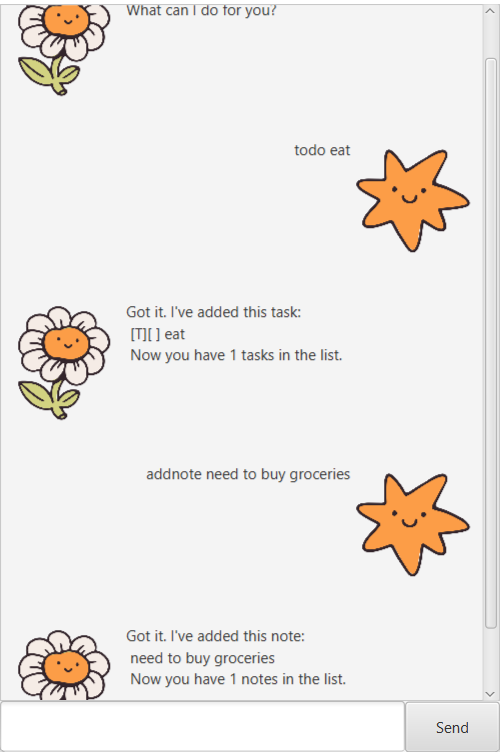

# User Guide

Welcome to Duke! 

Duke is a **desktop app for managing ToDo tasks, deadlines and events, as well as 
note-taking, optimised for use via a Graphical User Interface (GUI).** If you can type fast, Duke can get
your task management sorted, hassle-free!
The best part is, all of your data will be saved, so you can refer to it any time, anywhere!

- Quick start
- Features
  - [Adding a ToDo task: `todo`](#adding-a-todo-task-todo)
  - [Adding a task with a Deadline: `deadline`](#adding-a-task-with-a-deadline-deadline)
  - [Adding an Event with start and end times: `event`](#adding-an-event-with-start-and-end-times-event)
  - [Adding a note: `addnote`](#adding-a-note-addnote)
  - [Listing all tasks: `list`](#listing-all-tasks-list)
  - [Listing all notes: `listnotes`](#listing-all-notes-listnotes)
  - [Marking a task as completed: `mark`](#marking-a-task-as-completed-mark)
  - [Marking a task as incomplete: `unmark`](#marking-a-task-as-incomplete-unmark)
  - [Locating tasks by keyword: `find`](#locating-tasks-by-keyword-find)
  - [Deleting a task: `delete`](#deleting-a-task-delete)
  - [Deleting a note: `deletenote`](#deleting-a-note-deletenote)
  - [Exiting the program: `bye`](#exiting-the-program-bye)

##Quick Start
1. Ensure you have Java 11 or above installed in your Computer.
2. Download the latest `duke.jar` from [here](https://github.com/ZHTang29/ip).
3. Copy the file to the folder you want to use as the _home folder_ for your Duke.
4. Double-click on the `duke.jar` file
   A GUI similar to the one below should appear within a few seconds. 
   

## Features 
> Notes about the command format:
> 
>  - Words in `UPPER_CASE` are the parameters to be supplied by the user
> 
>     e.g. in `todo TASKNAME`, `TASKNAME` is a parameter which can be used.
> 
> 
>  - Parameters must be in the specified order and format
>     e.g. in `event TASKNAME /from YYYY-MM-dd HHmm /to YYYY-MM-dd HHmm`, the `/from` must come
>      before the `to` and the dates and times should follow the specified format.
>
> 

### Adding a ToDo task: `todo`

Adds a ToDo task to the 'tasks' list.

Format: `todo TASKNAME`

i.e. `todo eat food` will add the task 'eat food' to the 'tasks' list.

### Adding a task with a Deadline: `deadline`

Adds a deadline task to the 'tasks' list.

Format: `deadline TASKNAME /by YYYY-MM-dd HHmm`

i.e. `deadline eat chicken /by 2023-05-04 1500` 
will add the task 'eat chicken (by 04/05/2023 15:00)' to the 'tasks' list.

> Backslashes and spaces before and after `/by` are extremely important!
> 
### Adding an Event with start and end times: `event`

Adds an event task to the 'tasks' list.

Format: `event TASKNAME /from YYYY-MM-dd HHmm /to YYYY-MM-dd HHmm`

i.e. `event play soccer /from 2023-02-02 1500 /to 2023-02-02 1530`
will add the task 'play soccer (from: 02/02/2023 15:00 to: 02/02/2023 15:30)' to the 'tasks' list.

> Backslashes and spaces before and after `/from` and `/to` are extremely important!

### Adding a note: `addnote`

Adds a custom note to the 'notes' list.
- Notes are stored separately from tasks

Format: `addnote NOTE_DETAILS`

i.e. `addnote watch Avatar because it is very good`
will add the note 'watch Avatar because it is very good' to the 'notes' list.

### Listing all tasks: `list`

Shows a list of all tasks in the 'tasks' list.

Format: `list`

### Listing all notes: `listnotes`

Shows a list of all the notes in the 'notes' list.

Format: `listnotes`

### Marking a task as completed: `mark`

Marks a specific task in the 'tasks' list as done.

Format: `mark INDEX_TO_MARK`
- Marks the task at the specified `INDEX_TO_MARK`
- The index refers to the index number shown in the displayed 'tasks' list
- The index **must be a positive integer** 1, 2, 3...

### Marking a task as incomplete: `unmark`

Marks a specific task in the 'tasks' list as undone.

Format: `unmark INDEX_TO_UNMARK`
- Unmarks the task at the specified `INDEX_TO_UNMARK`
- The index refers to the index number shown in the displayed 'tasks' list
- The index **must be a positive integer** 1, 2, 3...

### Locating tasks by keyword: `find`

Finds the tasks in the 'tasks' list containing the relevant keyword.

Format: `find KEYWORD`
- The search is **case-sensitive** e.g. `Eat` will not match `eat`
- The search returns all tasks containing the keyword e.g. `play` will match 
`play football`
- Partial matches will be matched i.e. `floor` will match `play floorball` and 
`sweep the floor`

### Deleting a task: `delete`

Deletes a specified task from the 'tasks' list

Format: `delete INDEX_TO_DELETE`
- Deletes the task at the specified `INDEX_TO_DELETE`
- The index refers to the index number shown in the displayed 'tasks' list
- The index **must be a positive integer** 1, 2, 3...

### Deleting a note: `deletenote`

Deletes a specified note from the 'tasks' list

Format: `deletenote INDEX_TO_DELETE`
- Deletes the note at the specified `INDEX_TO_DELETE`
- The index refers to the index number shown in the displayed 'notes' list
- The index **must be a positive integer** 1, 2, 3...

### Exiting the program: `bye`

Exits Duke.

Format: `bye`

### Saving the data

Duke data is saved in the hard disk automatically after any command that changes the data.

There is no need to save manually.

### Editing the data file

Duke data is saved as a .txt file.

Advanced users are welcome to update data directly by editing that data file.

> Caution!
> 
> Should your changes to the data make the format invalid, Duke will not be able to run until the 
> changes are reverted to the latest valid version!

